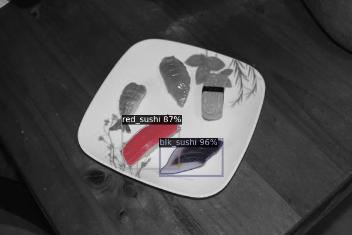

## Sushi Detector

This project segments from the background, a variety of sushi pieces. It can be used for counting the flavors of sushi items.

It uses [Detectron2](https://github.com/facebookresearch/detectron2 "Detectron2") a PyTorch-powered  object detection and segmentation framework. Detectron2 is designed to support research and production needs. As of this post, it is at version 0.1 yet it appears to be mature (presumable becasue it is a rewrite in PyTorch). So expect a lot when it does get mature.

This tutorial highlights the use of the training and evaluation APIs on a simple segmentation task. Note, Detectron2 is capable of other tasks such as panoptic segmentation, pose estimation, DensePose, etc.

## Detectron2 Installation 
The most concise install instructions are available at the top of the [Colab Notebook](https://colab.research.google.com/drive/16jcaJoc6bCFAQ96jDe2HwtXj7BMD_-m5) where you'll find the prerequisite libraries and the install step.

#### Verifying The Install
Run the followng in Python's interactive mode to ensure that the install was successful.

```
>>> from detectron2.engine import DefaultTrainer
```
## The Segmentation Task
The task is to segment two varieties of sushi on the plate (red sushi and black sushi). 
#### Input Image 


#### Output Image

The output shows the two varieties of sushis classsified, segmented and bounded (with a box). 
Note, we have annotations for only two varieties of sushi (red sushi and black). 


