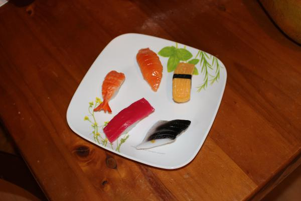

## Sushi Detector

This project segments from the background, a variety of sushi pieces. A simple use-case would be to use it for counting sushi in each category.

It uses [Detectron2](https://github.com/facebookresearch/detectron2 "Detectron2") a PyTorch-powered  object detection and segmentation framework. Detectron2 is designed to support research and production needs. As of this post, it is at version 0.1 yet it appears to be mature (presumable becasue it is a rewrite in PyTorch). So expect a lot when it does get mature.

This tutorial highlights the use of the training and evaluation APIs on a simple segmentation task. Note, Detectron2 is capable of other tasks such as panoptic segmentation, pose estimation, DensePose, etc.

## Detectron2 Installation 
The most concise install instructions are available at the top of the [Colab Notebook](https://colab.research.google.com/drive/16jcaJoc6bCFAQ96jDe2HwtXj7BMD_-m5) where you'll find the prerequisite libraries and the install step.

#### Verifying The Install
Run the followng in Python's interactive mode to ensure that the install was successful.

```
>>> from detectron2.engine import DefaultTrainer
```
## The Segmentation Task
The task is to segment two varieties of sushi on the plate (red sushi and black sushi). 
#### Input Image 



#### Output Image

The output shows the two varieties of sushis classsified, segmented and bounded (with a box). 
Note, we have trained with annotations for only two varieties of sushi (red sushi and black sushi). 

We'll add annotations for the other categories of sushi soon.  


## Training

The default (or standard) model training workflow  can be captured in the three lines of code below. It creates a model, the optimizer, scheduler, dataloader from the given config (```cfg```). The next step is to load the model weights (optionally, from the last checkpoint). The final step is to kick off the training.

```
trainer = DefaultTrainer(cfg)
trainer.resume_or_load(resume=False)  # load MODEL.WEIGHTS, not the last checkpoint
trainer.train()
```

## Prediction

The instantiated predictor takes as input, an image, resizes it to the specified resolution, runs the model and produces a dict of predictions. Model loading and input preprocessing is taken care of for you via the configuration. 

```
pred = DefaultPredictor(cfg)
inputs = cv2.imread("input.jpg")
outputs = pred(inputs)
```

## Visualization

The Visualizer class can be initialized with 
- an image of shape height, width, channels (and RGB format for the channels),
- the superimposed metadata, and
- a scale

The `draw_dataset_dict` method draws annotations/segmentaions in the Detectron2 Dataset format and returns the superimposed image object with visulizations. The OpenCV library can be used to display the visualization. 

```
from detectron2.utils.visualizer import Visualizer
for dict in random.sample(dataset_dicts, 3):
    img = cv2.imread(dict["file_name"])
    visualizer = Visualizer(img[:, :, ::-1],  # reverse channels
                            metadata=sushi_metadata,
                            scale=1.0)
    vis = visualizer.draw_dataset_dict(dict)
    cv2.imshow('window', vis.get_image()[:, :, ::-1])
```